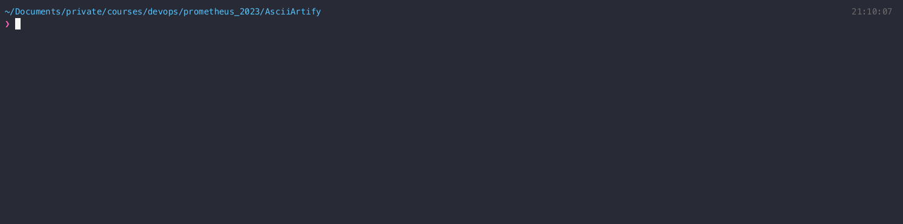

### Introduction:
The startup "AsciiArtify" has requested your assistance in preparing a comparative analysis of three tools for deploying Kubernetes clusters in a local environment: `minikube`, `kind`, and `k3d`. 
AsciiArtify aims to develop a new software product that uses machine learning to transform images into ascii-art .

### Characteristics:
1. __Minikube__: `Minikube` is a local Kubernetes system that allows you to deploy a Kubernetes cluster on a single computer. It is a convenient option for development and testing on a local machine. However, there are concerns regarding its scalability limitations. `Minikube` supports various operating systems and architectures, and it provides automation capabilities. It offers additional features such as monitoring and managing Kubernetes clusters.

2. __Kind__ (Kubernetes IN Docker): `Kind` is a tool that enables the creation of local Kubernetes clusters using Docker containers. `Kind` supports multiple operating systems and architectures, and it also provides automation capabilities. However, compared to `Minikube`, it may have differences in terms of additional features like monitoring and managing Kubernetes clusters.

3. __K3d__: `K3d` is a tool for creating local Kubernetes clusters in Docker containers using Rancher Kubernetes Engine (RKE). It allows for quick creation and testing of Kubernetes clusters within Docker containers. `K3d` supports various operating systems and architectures and provides automation capabilities. It also offers additional features like monitoring and managing Kubernetes clusters.

### Advantages and Disadvantages:
1. __Minikube__:
   - <u>Advantages</u>: `Minikube` is easy to use and provides a quick setup for local development and testing. It supports multiple operating systems and architectures and offers additional features for monitoring and managing Kubernetes clusters.
   - <u>Disadvantages</u>: `Minikube` may have limitations when it comes to scalability, which could be a concern for AsciiArtify's future requirements. It may require additional configurations for customization.

2. __Kind__:
   - <u>Advantages</u>: `Kind` allows for the creation of local Kubernetes clusters using Docker, providing flexibility and portability. It supports multiple operating systems and architectures and offers automation capabilities.
   - <u>Disadvantages</u>: `Kind` may lack certain additional features for monitoring and managing Kubernetes clusters compared to Minikube. AsciiArtify should evaluate if those features are essential for their needs.

3. __K3d__:
   - <u>Advantages</u>: `K3d` enables quick creation and testing of Kubernetes clusters within Docker containers. It supports various operating systems and architectures and offers automation capabilities. It provides additional features for monitoring and managing Kubernetes clusters.
   - <u>Disadvantages</u>: As a relatively newer tool, `K3d` may have a smaller community and documentation compared to `Minikube` and `Kind`. AsciiArtify should consider community support availability when using `K3d`.

### Demonstration:
Here is a brief demonstration of deploying a "Hello World" application on Kubernetes using the `k3d` tool selected for POC:

### Comparative analysis matrix

| **Criteria**                            | **Minikube**                                       | **Kind**                                           | **K3d**                                             |
|--------------------------------------|---------------------------------------------------|---------------------------------------------------|---------------------------------------------------|
| **Docker-based**                        | Yes                                               | Yes                                               | Yes                                               |
| **Podman Compatibility**                 | No                                                | No                                                | Yes                                               |
| **License Considerations**               | Docker licensing terms and compliance required    | Docker licensing terms and compliance required    | Docker licensing terms and compliance required    |
| **Ease of Use**                          | Easy to set up and use                            | Easy to set up and use                            | Easy to set up and use                            |
| **Scalability**                          | Limited scalability options                       | Limited scalability options                       | Quick creation and testing of Kubernetes clusters |
| **Supported Operating Systems**          | Windows, macOS, Linux                             | Windows, macOS, Linux                             | Windows, macOS, Linux                             |
| **Automation Capabilities**               | Yes                                               | Yes                                               | Yes                                               |
| **Additional Features**                   | Monitoring and managing Kubernetes clusters       | Monitoring and managing Kubernetes clusters       | Monitoring and managing Kubernetes clusters       |
| **Community Support and Documentation**   | Well-established community and extensive documentation | Well-established community and extensive documentation | Growing community and documentation              |

### Conclusions:
Based on the analysis, the following recommendations can be made for AsciiArtify's proof of concept:

1. __Minikube__: It provides a straightforward setup for local development and testing, with additional features for monitoring and managing Kubernetes clusters. However, scalability limitations should be considered for future growth.

2. __Kind__: It allows for the creation of local Kubernetes clusters using Docker containers, providing flexibility and portability. It supports multiple operating systems and architectures and offers automation capabilities. While it may lack certain additional features compared to `Minikube`, AsciiArtify should evaluate if those features are critical for their specific needs.

3. __K3d__: It offers quick creation and testing of Kubernetes clusters within Docker containers, with support for various operating systems and architectures. It provides automation capabilities and additional features for monitoring and managing Kubernetes clusters. However, as a relatively newer tool, AsciiArtify should consider the availability of community support and documentation when using K3d.

Considering the requirements of AsciiArtify's startup and the comparative analysis of the tools, the following recommendations can be made:

For the initial proof of concept (PoC), it is recommended to use `k3d` if AsciiArtify prefers a tool with faster cluster creation and testing capabilities, as well as comprehensive support for monitoring and managing Kubernetes clusters. However, they should consider the availability of community support and documentation, given that `K3d` is a relatively newer tool.
